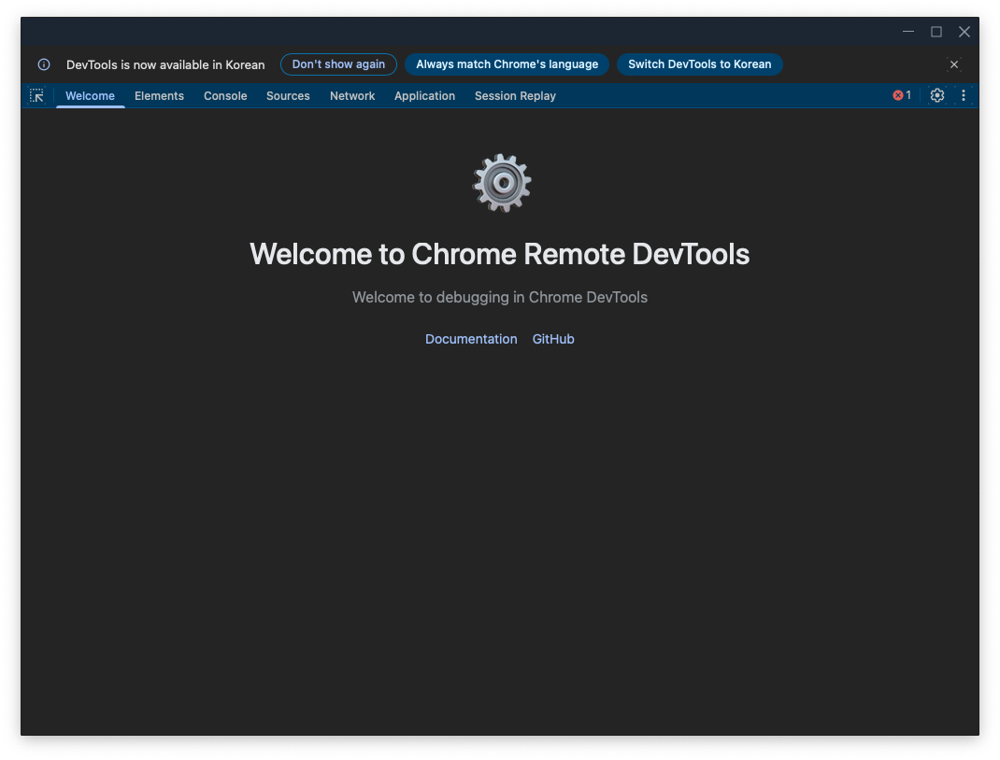
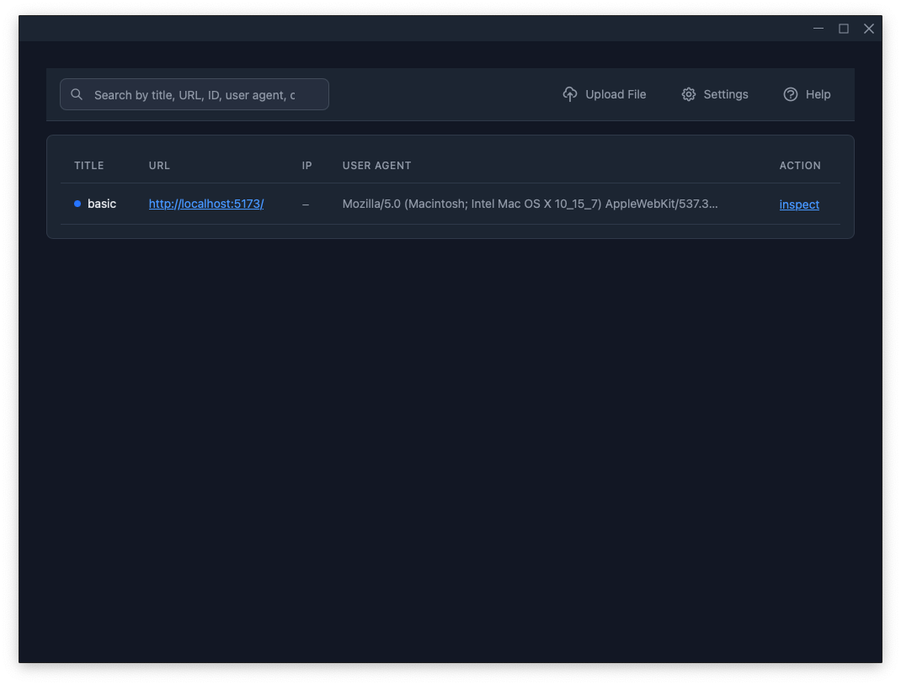
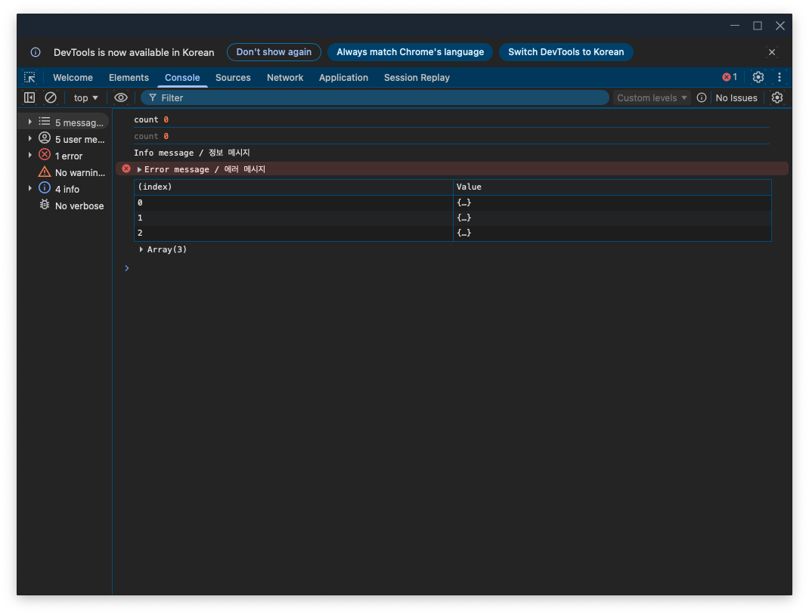
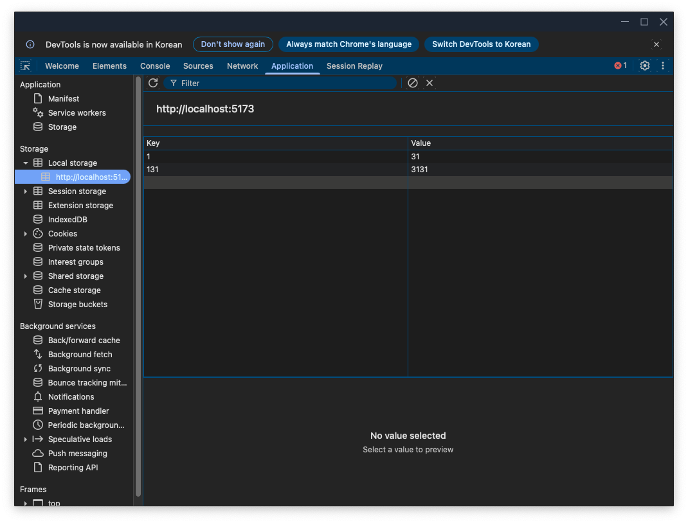
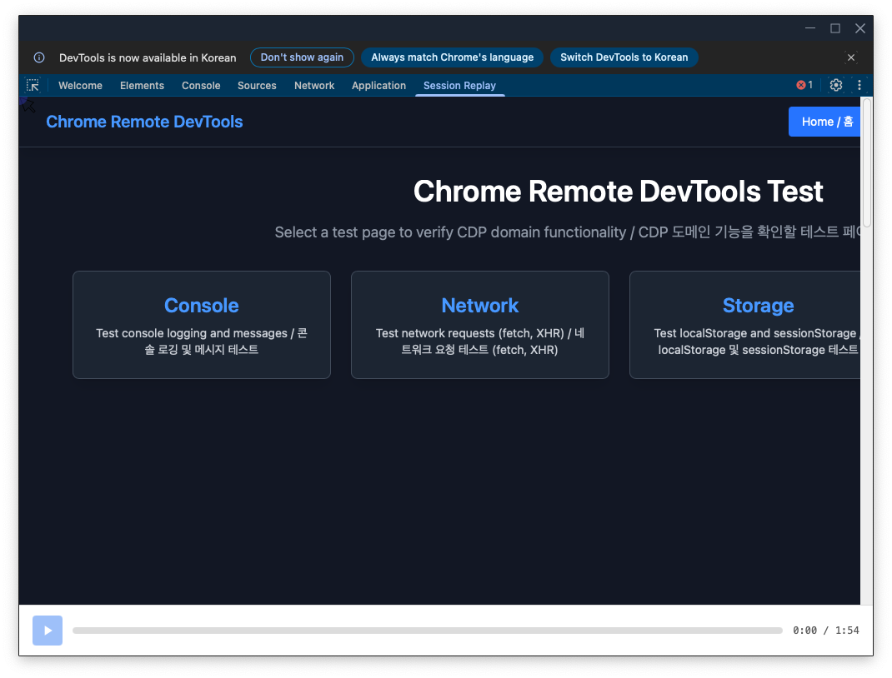

# Chrome Remote DevTools

[English](README.md) | [한국어](README_KO.md)

Chrome DevTools Protocol (CDP)을 활용하여 원격 크롬 브라우저를 제어하고 디버깅하는 도구입니다.

## 개요

Chrome Remote DevTools는 클라이언트 사이드에서 CDP를 구현하고 WebSocket 서버를 통해 메시지를 중계하여 웹 페이지를 원격으로 디버깅할 수 있게 해주는 도구입니다. 완전한 기능을 갖춘 DevTools 인터페이스를 제공합니다.


## 주요 기능

- **연결 관리**: 원격 크롬 인스턴스에 WebSocket 연결 및 자동 재연결
- **페이지 제어**: 네비게이션 및 페이지 정보 조회
- **콘솔 및 로깅**: 콘솔 메시지 수신 및 표시, JavaScript 실행
- **네트워크 모니터링**: 네트워크 요청/응답 추적, 요청 차단 및 수정
- **스토리지 관리**: 세션 스토리지, 로컬 스토리지, 쿠키 조회 및 관리
- **세션 리플레이**: 사용자 상호작용 및 페이지 변경 기록 및 재생
- **오프라인 로깅**: 로컬에서 로그를 캡처하고 저장하여 오프라인 분석
- **Redux DevTools**: Chrome Extension과 동일한 UI를 제공하는 Redux DevTools Extension 통합

## 아키텍처

### 3-Tier 구조

```
[디버깅 대상 웹페이지] ←→ [Rust WebSocket 중계 서버] ←→ [Inspector (웹/데스크탑)]
     (client)                    (server)                      (inspector)
```

### 패키지 구조

- **chrome-remote-devtools-server** (Rust): WebSocket 중계 서버 (독립 실행형 또는 Tauri에 내장)
- **@ohah/chrome-remote-devtools-client**: CDP 클라이언트 (JavaScript, 웹페이지에 로드)
- **@ohah/chrome-remote-devtools-inspector**: Inspector UI (React + Vite, 웹/데스크탑 공유)

### 데이터 저장소

- **IndexedDB**: 브라우저에서 오프라인 로깅 및 세션 리플레이 데이터 저장에 사용

## 기술 스택

- **백엔드**: Rust (WebSocket 서버), TypeScript (클라이언트)
- **프론트엔드**: React + Vite, TypeScript, Tauri (데스크탑 앱용)
- **DevTools**: devtools-frontend (Google 오픈소스, 포크 사용)
- **도구**: oxlint/oxfmt, rustfmt/clippy, mise (도구 버전 관리)

## 사전 요구사항

- [Bun](https://bun.sh) (최신 버전)
- [Rust](https://www.rust-lang.org/) (stable)
- [mise](https://mise.jdx.dev/) (도구 버전 관리용)
- Git

## 설치 방법

### 1. 저장소 클론

```bash
git clone https://github.com/ohah/chrome-remote-devtools.git
cd chrome-remote-devtools
```

### 2. 프로젝트 초기화

초기화 스크립트를 실행하여 의존성과 레퍼런스 저장소를 설정합니다:

```bash
# OS를 자동으로 감지하여 적절한 스크립트 실행
bun run init

# 또는 수동으로:
# Windows:
scripts\init.bat

# Linux/macOS:
bash scripts/init.sh
```

이 스크립트는 다음을 수행합니다:

- Bun 의존성 설치
- Rust 의존성 설치
- 레퍼런스 저장소 클론 (chii, chobitsu, devtools-remote-debugger, devtools-protocol, rrweb, redux-devtools)

### 3. 설치 확인

```bash
# Bun 버전 확인
bun --version

# Rust 버전 확인
rustc --version
```

## 사용 방법

### 개발

개발 서버를 시작합니다:

```bash
# WebSocket 중계 서버 시작 (Rust)
cargo run --bin chrome-remote-devtools-server -- --port 8080

# Inspector 웹 버전 시작
bun run dev:inspector

# Inspector 데스크탑 버전 시작 (Tauri)
bun run dev:inspector:tauri

# 문서 사이트 시작
bun run dev:docs
```

### 빌드

모든 패키지를 빌드합니다:

```bash
# OS를 자동으로 감지
bun run build

# 또는 수동으로:
# Windows:
scripts\build.bat

# Linux/macOS:
bash scripts/build.sh
```

## 개발 명령어

```bash
# 개발 서버
cargo run --bin chrome-remote-devtools-server  # Rust WebSocket 서버만
bun run dev:inspector       # Inspector 웹만
bun run dev:inspector:tauri  # Inspector 데스크탑
bun run dev:docs            # 문서 페이지

# 코드 품질
bun run lint                # oxlint 실행
bun run format              # oxfmt로 포맷팅
bun run format:rust         # rustfmt로 Rust 코드 포맷팅

# 빌드
bun run build               # 전체 패키지 빌드
bun run build:devtools      # Redux DevTools 플러그인 및 devtools-frontend 빌드
```

## 프로젝트 구조

```
chrome-remote-devtools/
├── crates/
│   └── server/          # WebSocket 중계 서버 (Rust)
├── packages/
│   ├── client/          # CDP 클라이언트 (웹페이지용)
│   └── inspector/       # Inspector UI (React + Vite, 웹/데스크탑)
├── document/            # RSPress 문서 페이지
├── devtools/
│   └── devtools-frontend/  # DevTools 프론트엔드
└── reference/           # 참조 코드 (gitignore)
    ├── chii/
    ├── chobitsu/
    ├── devtools-remote-debugger/
    ├── devtools-protocol/
    ├── rrweb/
    └── redux-devtools/  # Redux DevTools Extension 소스
```

## 통신 흐름

1. 클라이언트(`client`)가 WebSocket으로 서버에 연결
2. Inspector가 WebSocket으로 서버에 연결
3. 서버가 CDP 메시지를 양방향으로 전달 (프록시 역할)
4. 클라이언트가 CDP 프로토콜을 클라이언트 사이드에서 구현

## 기여하기

기여를 환영합니다! 자세한 내용은 [CONTRIBUTING.md](CONTRIBUTING.md)를 참고하세요.

- [행동 강령](CONTRIBUTING.ko.md#code-of-conduct)
- [개발 환경 설정](CONTRIBUTING.ko.md#개발-환경-설정)
- [커밋 가이드라인](CONTRIBUTING.ko.md#커밋-메시지-가이드라인)

## 라이센스

MIT License - 자세한 내용은 [LICENSE](LICENSE) 파일을 참고하세요.

## Redux DevTools 통합

Chrome Remote DevTools는 공식 Chrome Extension과 동일한 UI를 제공하는 Redux DevTools 패널을 포함합니다. 패널은 `@redux-devtools/app`을 UI로 사용하고 CDP 프로토콜을 통해 통신합니다.

### Redux DevTools 빌드

Redux DevTools 플러그인과 devtools-frontend를 빌드하려면:

```bash
bun run build:devtools
```

이 명령은 다음을 수행합니다:

1. `@ohah/redux-devtools-plugin` 패키지 빌드
2. Redux 패널이 포함된 devtools-frontend 빌드
3. 빌드된 파일을 `devtools/bundled/`로 복사

### Redux 패널

Redux 패널은 DevTools panel view에서 사용할 수 있습니다. 다음을 사용합니다:

- **ReduxExtensionBridge**: CDP 메시지 버퍼링 및 플러그인 iframe으로 전달 관리
- **CDP 이벤트**: `Redux.message` 이벤트 리스닝 (INIT, ACTION, STATE 등)
- **@redux-devtools/app**: Redux DevTools UI 제공

### React Native 통합

React Native 앱에서는 `@ohah/chrome-remote-devtools-react-native`의 미들웨어를 사용합니다:

```typescript
// Redux 미들웨어
import { createReduxDevToolsMiddleware } from '@ohah/chrome-remote-devtools-react-native/redux';

const store = createStore(
  rootReducer,
  applyMiddleware(createReduxDevToolsMiddleware({ name: 'MyApp' }))
);

// Zustand 미들웨어
import { chromeDevtools } from '@ohah/chrome-remote-devtools-react-native/zustand';

const useStore = create(
  chromeDevtools((set) => ({ ... }), { name: 'MyStore' })
);
```

Redux 액션과 상태 변경은 CDP 메시지로 전송되어 Redux 패널에 표시됩니다.

## 참조 프로젝트

이 프로젝트는 다음 프로젝트들을 참고하여 만들어졌습니다:

- [devtools-remote-debugger](https://github.com/Nice-PLQ/devtools-remote-debugger) - 클라이언트 사이드 CDP 구현
- [chii](https://github.com/liriliri/chii) - chobitsu를 사용한 원격 디버깅 도구
- [chobitsu](https://github.com/liriliri/chobitsu) - CDP 프로토콜 JavaScript 구현 라이브러리
- [devtools-protocol](https://github.com/ChromeDevTools/devtools-protocol) - 공식 CDP 정의
- [redux-devtools](https://github.com/reduxjs/redux-devtools) - Redux DevTools Extension 소스 코드

## 사용 화면

### 환영 화면



### 클라이언트 목록



### 콘솔 패널



### 네트워크 패널


### 애플리케이션 패널



### 세션 리플레이 패널



## 링크

- [문서](https://ohah.github.io/chrome-remote-devtools/)
- [이슈](https://github.com/ohah/chrome-remote-devtools/issues)
- [토론](https://github.com/ohah/chrome-remote-devtools/discussions)
