# Chrome Remote DevTools

[English](README.md) | [한국어](README_KO.md)

Chrome DevTools Protocol (CDP)을 활용하여 원격 크롬 브라우저를 제어하고 디버깅하는 도구입니다.

## 개요

Chrome Remote DevTools는 클라이언트 사이드에서 CDP를 구현하고 WebSocket 서버를 통해 메시지를 중계하여 웹 페이지를 원격으로 디버깅할 수 있게 해주는 도구입니다. 완전한 기능을 갖춘 DevTools 인터페이스를 제공합니다.


## React Native

**React Native 앱도 Chrome DevTools로 디버깅할 수 있습니다.**

**@ohah/chrome-remote-devtools-inspector-react-native** 플러그인을 사용하면, React Native 앱을 같은 Inspector(콘솔, 네트워크, Redux 등)에 중계 서버를 통해 연결할 수 있습니다. 콘솔/네트워크용 네이티브 모듈 없이, 전부 JavaScript에서 동작합니다.

### 제공 기능

- **콘솔**: DevTools Console 탭에서 `console.log` / `warn` / `error` 확인 및 객체 검사
- **네트워크**: Network 패널에서 `fetch`, `XMLHttpRequest` 추적
- **Redux / Zustand**: Chrome Extension과 동일한 Redux DevTools UI, Redux Toolkit·Zustand 지원
- **MMKV / AsyncStorage**: 선택 사항으로 스토리지 조회·편집용 DevTools 패널

### 빠른 시작 (4단계)

**1. 패키지 설치**

```bash
npm install @ohah/chrome-remote-devtools-inspector-react-native
# 또는: yarn add / bun add
```

**2. 앱 진입 파일**에서 한 번만 import (스토어 생성 전에 Redux DevTools polyfill 실행용)

```typescript
import '@ohah/chrome-remote-devtools-inspector-react-native';
```

**3. 앱을 Provider로 감싸기.** Inspector 기기 목록에 보이려면 안정적인 `deviceId`(예: `react-native-device-info`)가 필요합니다.

```typescript
import { ChromeRemoteDevToolsInspectorProvider } from '@ohah/chrome-remote-devtools-inspector-react-native';
import { getUniqueId } from 'react-native-device-info';

// 루트 컴포넌트에서:
const [deviceId, setDeviceId] = useState<string | null>(null);
useEffect(() => {
  getUniqueId().then(setDeviceId).catch(() => setDeviceId('device-' + Date.now()));
}, []);

if (!deviceId) return <Loading />;

return (
  <ChromeRemoteDevToolsInspectorProvider
    serverHost="localhost"   // 실기기면 PC IP 사용
    serverPort={8080}
    deviceId={deviceId}
  >
    {/* 앱 내용 */}
  </ChromeRemoteDevToolsInspectorProvider>
);
```

**4. 중계 서버와 Inspector 실행**

```bash
# 터미널 1: 중계 서버
cargo run --bin chrome-remote-devtools-server -- --port 8080

# 터미널 2: Inspector (웹 또는 데스크탑)
bun run dev:inspector
# 또는: bun run dev:inspector:tauri
```

브라우저(또는 Tauri 앱)에서 Inspector를 연 뒤, RN 앱을 실행하면 기기 목록에 표시됩니다. 해당 기기를 선택하면 DevTools(콘솔, 네트워크, Redux 등)를 사용할 수 있습니다.

### 팁

- **iOS 시뮬레이터**: `serverHost="localhost"` 그대로 사용
- **Android 에뮬레이터**: `adb reverse tcp:8080 tcp:8080` 실행 후 `localhost` 사용
- **실기기**: `serverHost`를 PC의 LAN IP로 설정 (예: `192.168.1.100`)
- **Console 탭이 비어 있을 때**: DevTools Console에서 컨텍스트 드롭다운을 열고 "Selected context only" 해제, 또는 "React Native" 컨텍스트 선택

### Redux / Zustand

Metro 설정을 추가하고 Redux Toolkit은 `devTools: true`, Zustand는 `devtools()`를 사용하면 됩니다. Metro 설정과 예시는 [React Native Inspector README](packages/react-native-inspector/README_KO.md)를 참고하세요.

### 상세 문서와 예제

- **패키지 README**: [packages/react-native-inspector/README_KO.md](packages/react-native-inspector/README_KO.md) (설치, Provider, MMKV, AsyncStorage, Metro, Redux/Zustand)
- **예제 앱**: [examples/react-native](examples/react-native) (이 레포의 전체 설정 예시)

**요구사항**: React Native >= 0.76.0, iOS >= 15.1.

### React Native 실행 화면

| 환영 화면                                     | 콘솔                                     | 네트워크                                     |
| --------------------------------------------- | ---------------------------------------- | -------------------------------------------- |
| 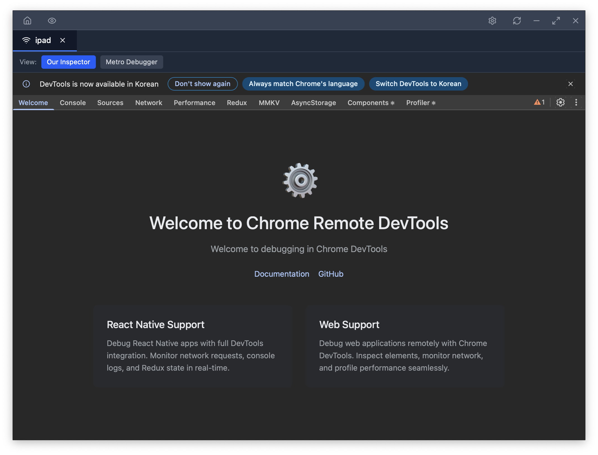 | 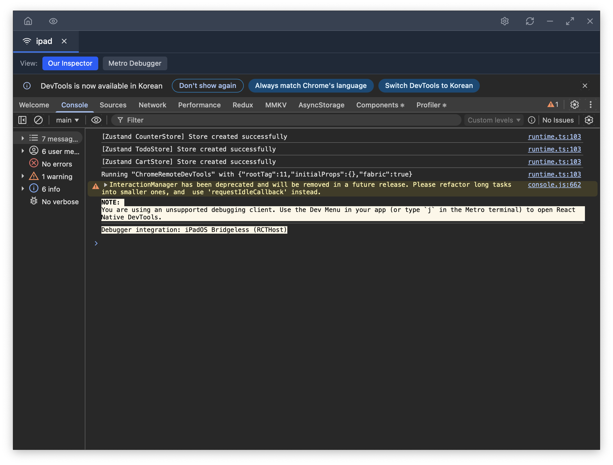 | 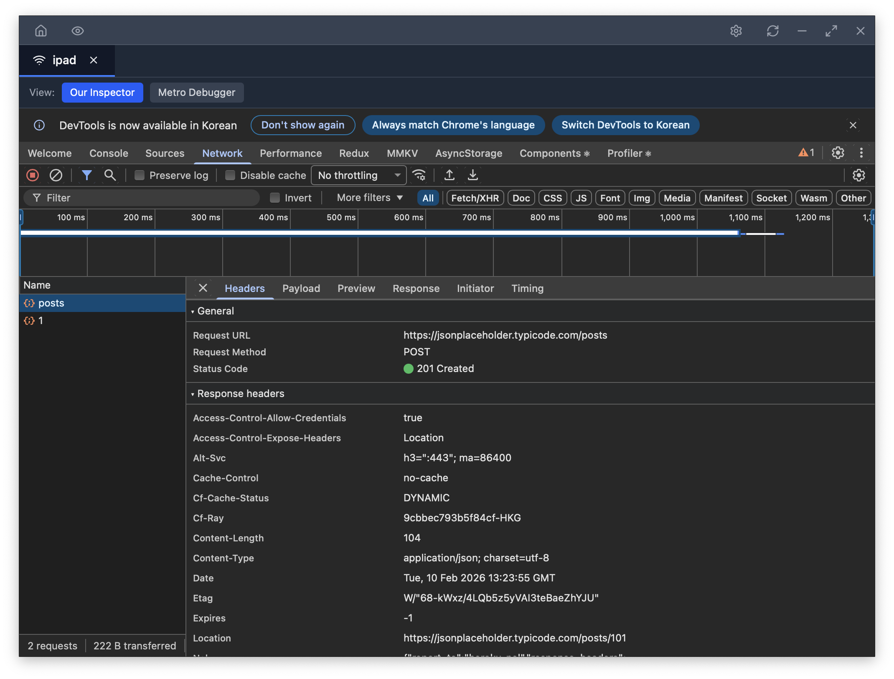 |

| Redux                                   | MMKV                                  | AsyncStorage                                          |
| --------------------------------------- | ------------------------------------- | ----------------------------------------------------- |
| 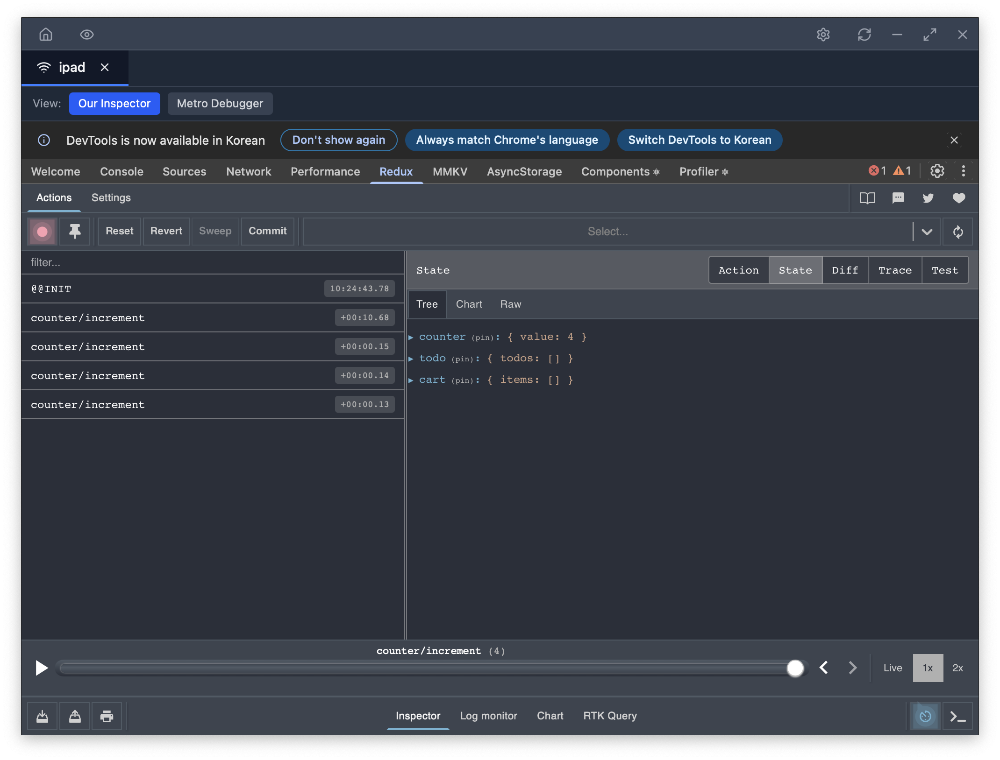 | 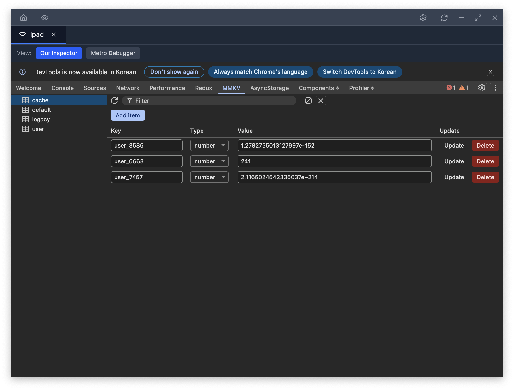 | 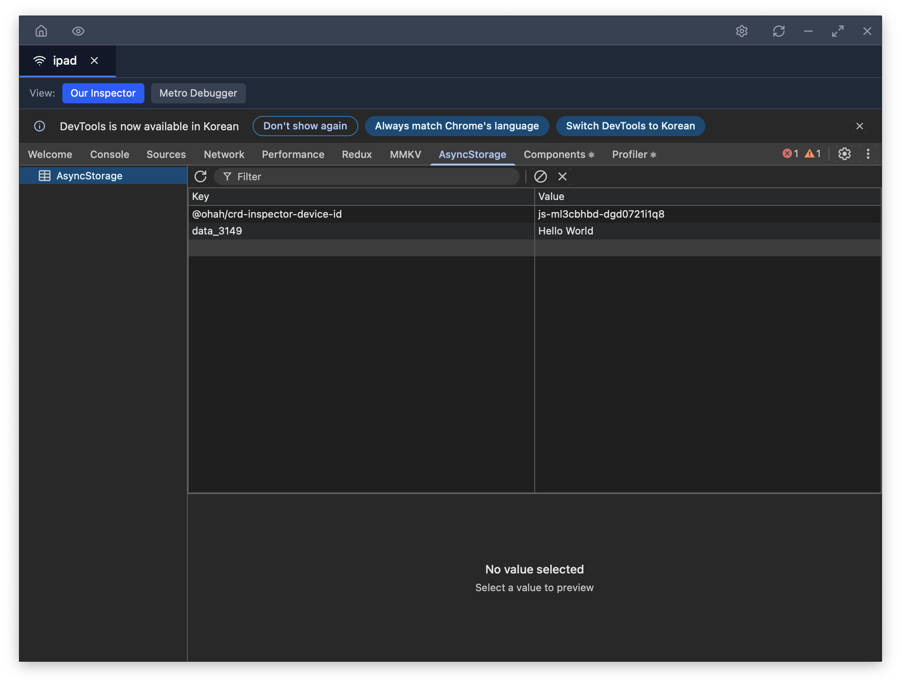 |

| 컴포넌트                                        | 성능                                         | 프로파일러                                      | 소스                                    |
| ----------------------------------------------- | -------------------------------------------- | ----------------------------------------------- | --------------------------------------- |
| 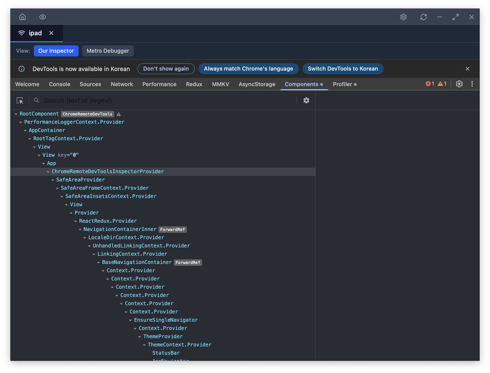 | 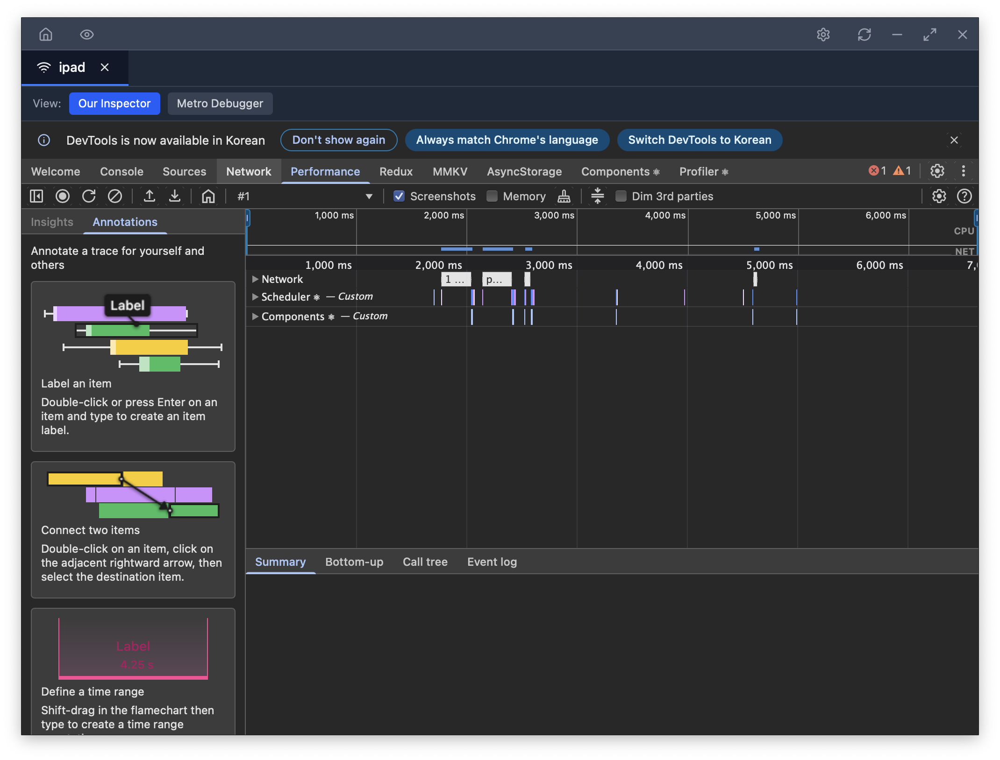 | 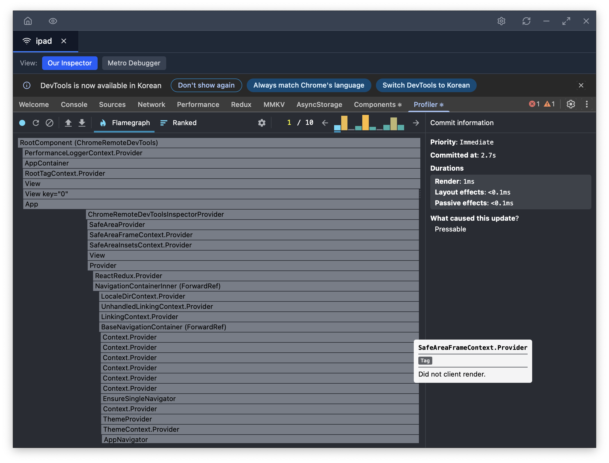 | 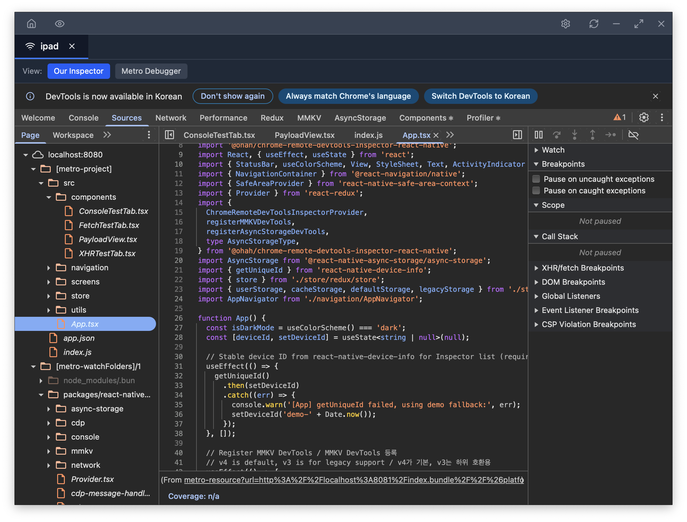 |

---

## 주요 기능

- **연결 관리**: 원격 크롬 인스턴스에 WebSocket 연결 및 자동 재연결
- **페이지 제어**: 네비게이션 및 페이지 정보 조회
- **콘솔 및 로깅**: 콘솔 메시지 수신 및 표시, JavaScript 실행
- **네트워크 모니터링**: 네트워크 요청/응답 추적, 요청 차단 및 수정
- **스토리지 관리**: 세션 스토리지, 로컬 스토리지, 쿠키 조회 및 관리
- **세션 리플레이**: 사용자 상호작용 및 페이지 변경 기록 및 재생
- **오프라인 로깅**: 로컬에서 로그를 캡처하고 저장하여 오프라인 분석
- **Redux DevTools**: Chrome Extension과 동일한 UI를 제공하는 Redux DevTools Extension 통합

## 아키텍처

### 3-Tier 구조

```
[디버깅 대상 웹페이지] ←→ [Rust WebSocket 중계 서버] ←→ [Inspector (웹/데스크탑)]
     (client)                    (server)                      (inspector)
```

### 패키지 구조

- **chrome-remote-devtools-server** (Rust): WebSocket 중계 서버 (독립 실행형 또는 Tauri에 내장)
- **@ohah/chrome-remote-devtools-client**: CDP 클라이언트 (JavaScript, 웹페이지에 로드)
- **@ohah/chrome-remote-devtools-inspector**: Inspector UI (React + Vite, 웹/데스크탑 공유)
- **@ohah/chrome-remote-devtools-inspector-react-native**: React Native 플러그인 (콘솔, 네트워크, Redux, MMKV, AsyncStorage; JavaScript 훅만 사용)

### 데이터 저장소

- **IndexedDB**: 브라우저에서 오프라인 로깅 및 세션 리플레이 데이터 저장에 사용

## 사용 방법

1. **중계 서버 실행** (기본 포트 8080):

   ```bash
   cargo run --bin chrome-remote-devtools-server -- --port 8080
   ```

2. **Inspector 실행** (웹 또는 데스크탑):

   ```bash
   bun run dev:inspector        # 웹
   bun run dev:inspector:tauri  # 데스크탑 (Tauri)
   ```

3. **클라이언트 연결**:
   - **웹**: 페이지에 클라이언트 스크립트 로드 (예: `<script src="http://localhost:8080/client.js" data-server-url="http://localhost:8080"></script>`), 브라우저에서 Inspector를 열고 클라이언트를 선택합니다.
   - **React Native**: 위 [React Native](#react-native) 설정(Provider + 서버 + Inspector)을 사용합니다.

소스 빌드, 개발 환경 설정, 전체 명령어는 [CONTRIBUTING.md](CONTRIBUTING.md)([한국어](CONTRIBUTING_KO.md))를 참고하세요.

## 통신 흐름

1. 클라이언트(`client`)가 WebSocket으로 서버에 연결
2. Inspector가 WebSocket으로 서버에 연결
3. 서버가 CDP 메시지를 양방향으로 전달 (프록시 역할)
4. 클라이언트가 CDP 프로토콜을 클라이언트 사이드에서 구현

## 기여하기

기여를 환영합니다! 자세한 내용은 [CONTRIBUTING.md](CONTRIBUTING.md)를 참고하세요.

- [행동 강령](CONTRIBUTING_KO.md#code-of-conduct)
- [개발 환경 설정](CONTRIBUTING_KO.md#개발-환경-설정)
- [커밋 가이드라인](CONTRIBUTING_KO.md#커밋-메시지-가이드라인)

## 라이센스

MIT License - 자세한 내용은 [LICENSE](LICENSE) 파일을 참고하세요.

## Redux DevTools 통합

Chrome Remote DevTools는 공식 Chrome Extension과 동일한 UI를 제공하는 Redux DevTools 패널을 포함합니다. 패널은 `@redux-devtools/app`을 UI로 사용하고 CDP 프로토콜을 통해 통신합니다. Redux DevTools 플러그인 및 devtools-frontend 빌드 방법은 [CONTRIBUTING.md](CONTRIBUTING_KO.md#개발-명령어-참고)(`bun run build:devtools`)를 참고하세요.

### Redux 패널

Redux 패널은 DevTools panel view에서 사용할 수 있습니다. 다음을 사용합니다:

- **ReduxExtensionBridge**: CDP 메시지 버퍼링 및 플러그인 iframe으로 전달 관리
- **CDP 이벤트**: `Redux.message` 이벤트 리스닝 (INIT, ACTION, STATE 등)
- **@redux-devtools/app**: Redux DevTools UI 제공

### React Native

React Native에서는 **@ohah/chrome-remote-devtools-inspector-react-native**로 동일한 Redux DevTools UI를 사용할 수 있습니다. [Metro 설정과 Provider](packages/react-native-inspector/README_KO.md)를 한 뒤, Redux Toolkit은 `devTools: true`, Zustand는 `devtools()`를 사용하면 됩니다. 전체 빠른 시작은 위의 [React Native](#react-native) 섹션을 참고하세요.

## 참조 프로젝트

이 프로젝트는 다음 프로젝트들을 참고하여 만들어졌습니다:

- [devtools-remote-debugger](https://github.com/Nice-PLQ/devtools-remote-debugger) - 클라이언트 사이드 CDP 구현
- [chii](https://github.com/liriliri/chii) - chobitsu를 사용한 원격 디버깅 도구
- [chobitsu](https://github.com/liriliri/chobitsu) - CDP 프로토콜 JavaScript 구현 라이브러리
- [devtools-protocol](https://github.com/ChromeDevTools/devtools-protocol) - 공식 CDP 정의
- [redux-devtools](https://github.com/reduxjs/redux-devtools) - Redux DevTools Extension 소스 코드

## 사용 화면

### 환영 화면

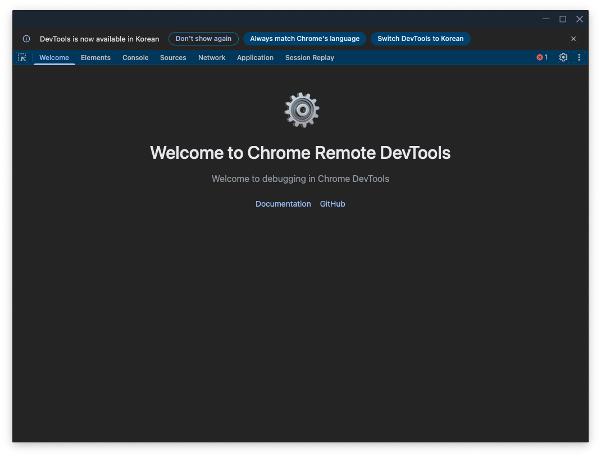

### 클라이언트 목록

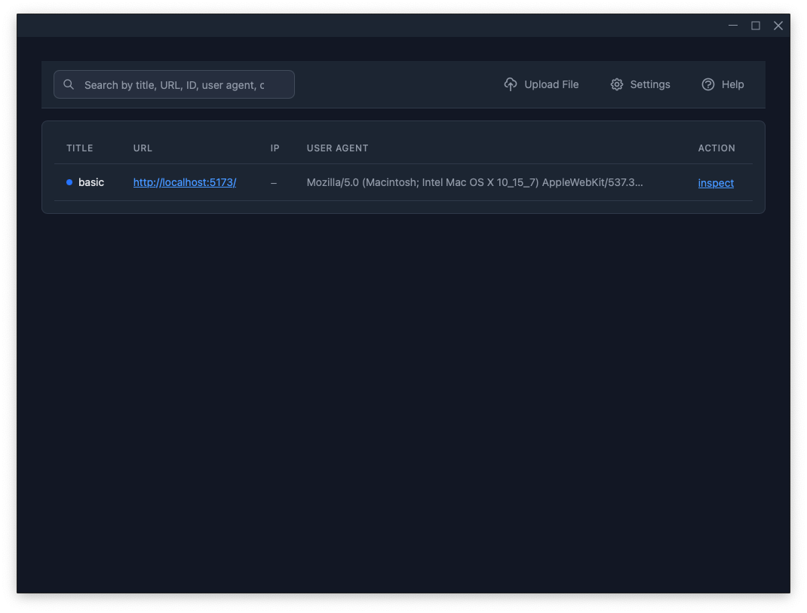

### 콘솔 패널

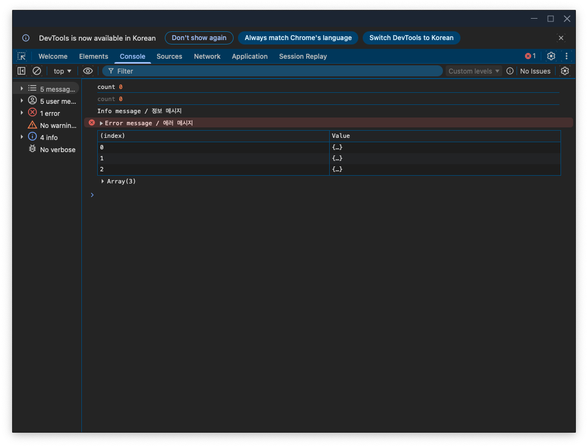

### 네트워크 패널

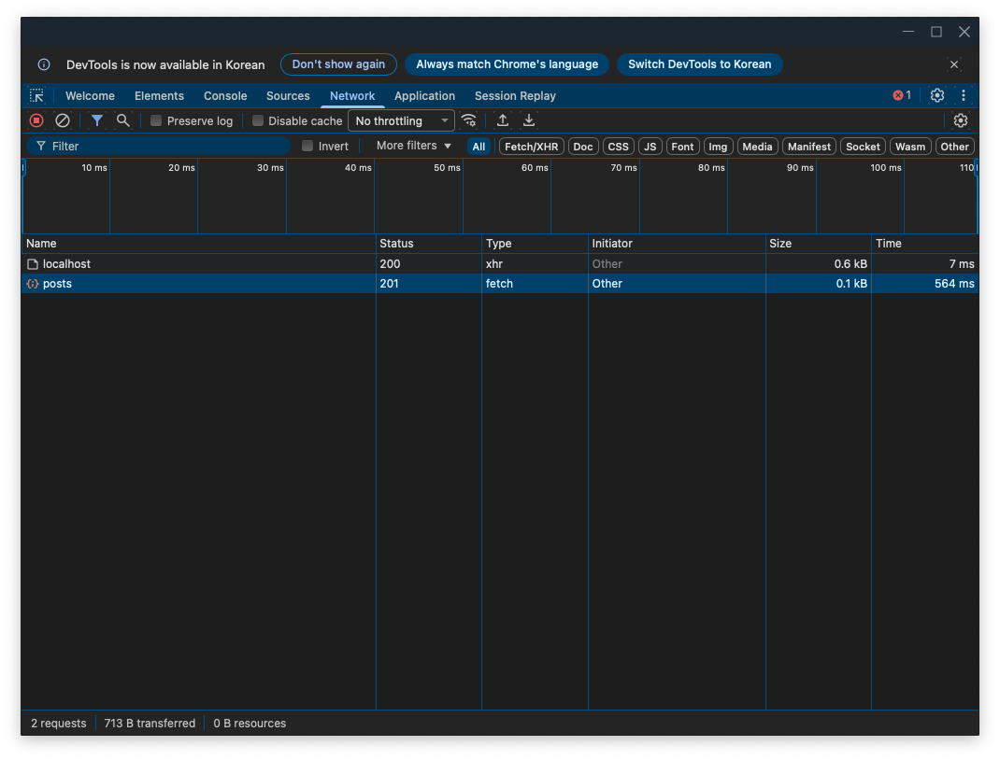

### 애플리케이션 패널

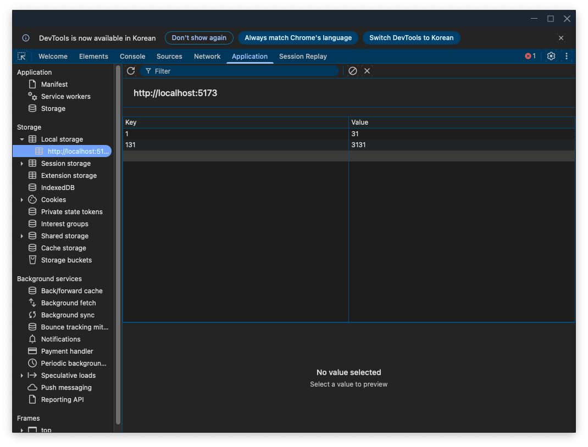

### 세션 리플레이 패널

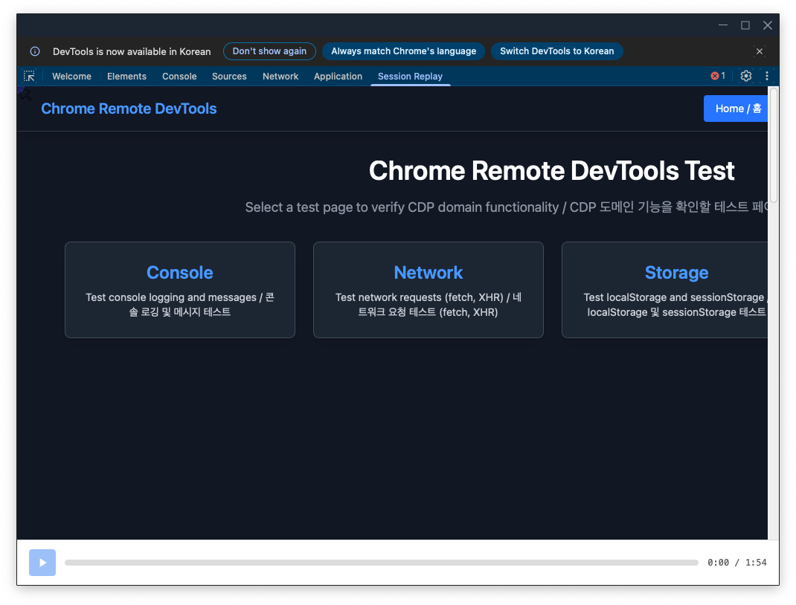

## 링크

- [문서](https://ohah.github.io/chrome-remote-devtools/)
- [이슈](https://github.com/ohah/chrome-remote-devtools/issues)
- [토론](https://github.com/ohah/chrome-remote-devtools/discussions)
