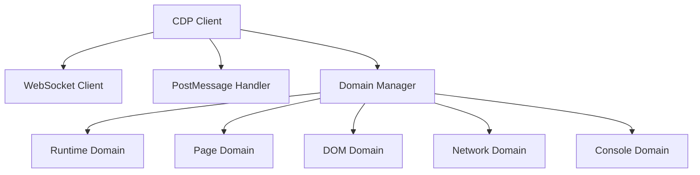
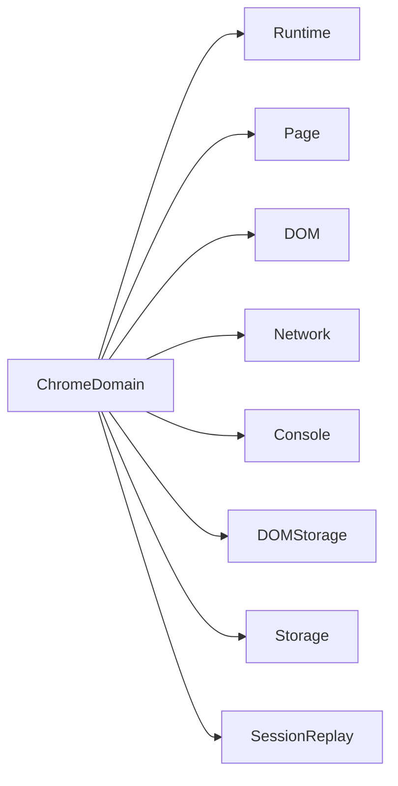
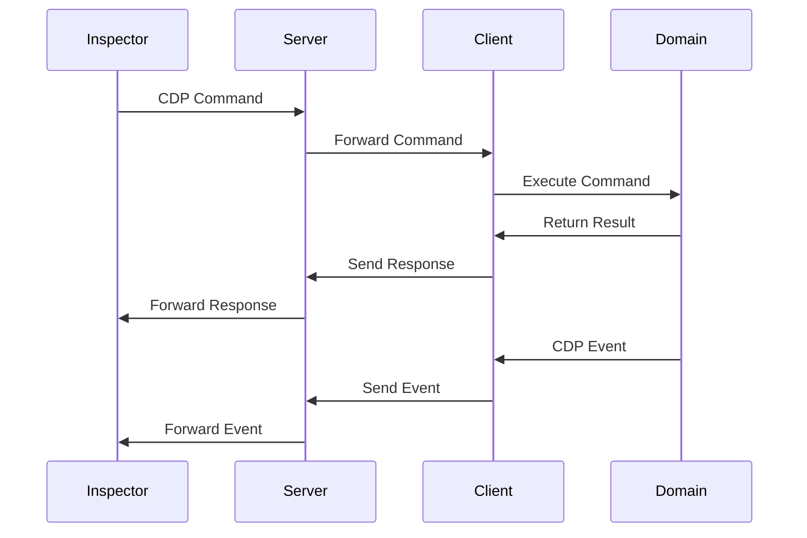
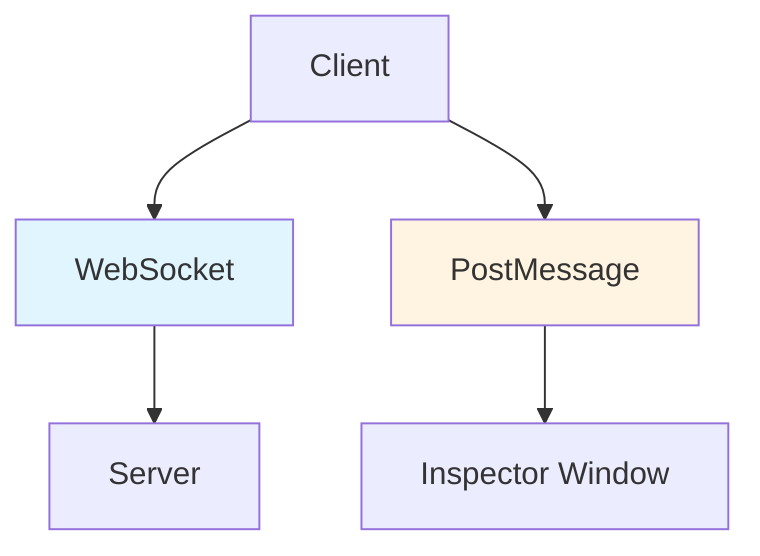

# Client Architecture

The client implements the Chrome DevTools Protocol (CDP) on the client side, allowing web pages to be debugged remotely.

## CDP Client Structure



## Domain Implementation

The client implements multiple CDP domains:



## Message Flow



## Connection Methods

The client supports two connection methods:

1. **WebSocket**: Remote debugging via server (general use case)
2. **PostMessage**: Communication via postMessage API (for local DevTools scenarios)



## Features

- **CDP Protocol Implementation**: Full client-side CDP implementation
- **Domain Support**: Multiple CDP domains (Runtime, Page, DOM, Network, etc.)
- **Event Handling**: Automatic event emission and storage
- **Dual Connection**: WebSocket and PostMessage support
- **Session Replay**: Optional rrweb integration for session recording

## Initialization

The client is initialized using the `init()` function:

```typescript
import { init } from '@ohah/chrome-remote-devtools-client';

init({
  serverUrl: 'ws://localhost:8080',
  rrweb: {
    enable: true,
  },
});
```

For vanilla JavaScript (IIFE), use the global API:

```html
<script src="./client.js"></script>
<script>
  ChromeRemoteDevTools.init({
    serverUrl: 'ws://localhost:8080',
    rrweb: {
      enable: true,
    },
  });
</script>
```
