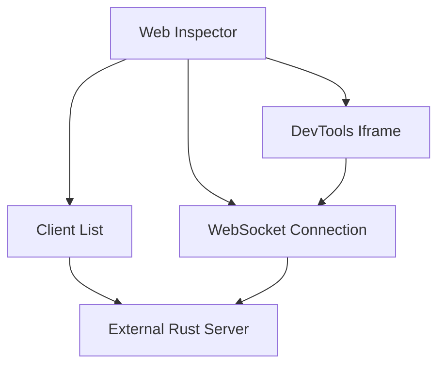
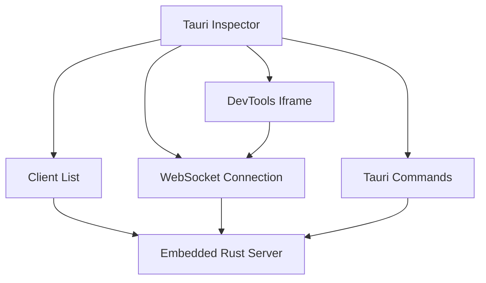
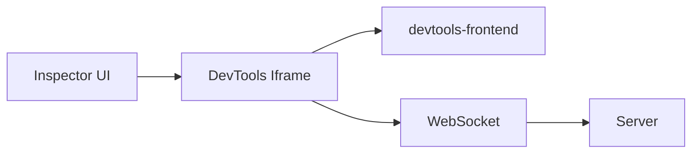
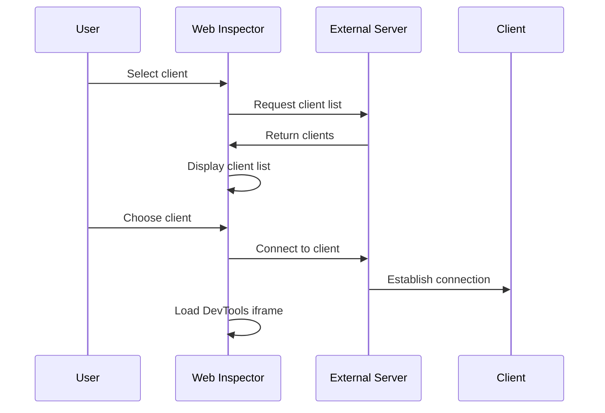
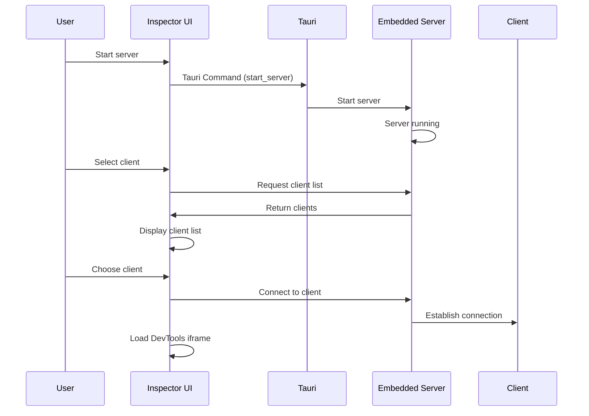
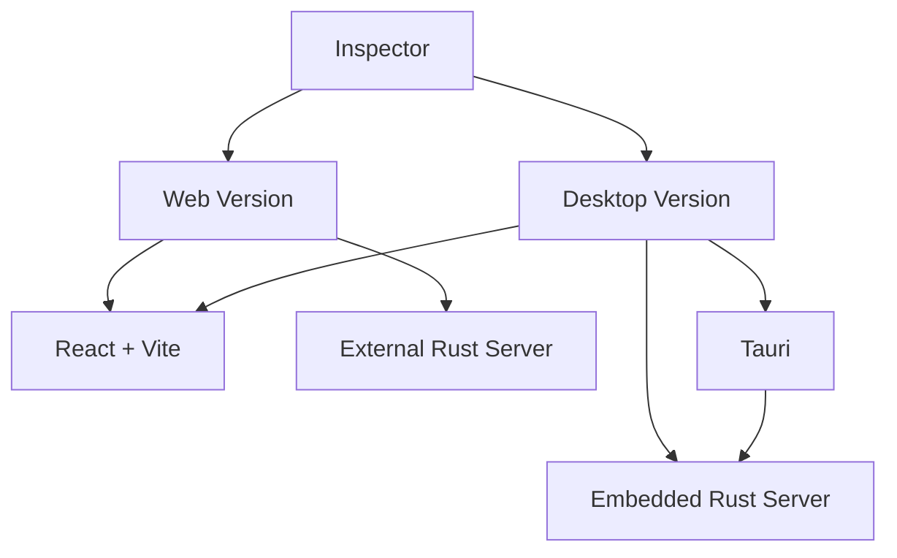

# Inspector Architecture

The Inspector provides the DevTools UI for debugging web pages remotely. It can run as a web application or desktop application (using Tauri). In the desktop version, Tauri embeds the Rust server, allowing use without running a separate server.

## Inspector Structure

### Web Inspector



### Desktop Inspector (Tauri)



## DevTools Integration

The Inspector integrates with devtools-frontend using an iframe:



## Client Selection Flow

### Web Inspector



### Desktop Inspector (Tauri)



## Web and Desktop Versions

The Inspector supports both web and desktop versions:



## Features

- **Client Discovery**: Automatically discover and list connected clients
- **Client Selection**: Switch between different clients
- **DevTools Integration**: Full DevTools UI via iframe
- **WebSocket Communication**: Direct connection to server
- **Auto-refresh**: Automatic client list updates
- **Embedded Server** (Desktop): Tauri app embeds Rust server, no separate server needed

## Implementation

The Inspector is implemented using:

- **React**: UI framework
- **Vite**: Build tool
- **TanStack Router**: Routing
- **Tailwind CSS**: Styling
- **Tauri**: Desktop app framework (desktop version)
- **Rust Server Library**: WebSocket server embedded in Tauri

## DevTools URL Construction

The Inspector builds DevTools URLs with WebSocket configuration:

```typescript
const devtoolsUrl = buildDevToolsUrl(clientId, serverUrl);
// Result: /devtools-frontend/?ws=localhost:8080/remote/debug/devtools/devtools-{clientId}?clientId={clientId}
```

The iframe loads this URL, which initializes devtools-frontend with the WebSocket connection to the server.
