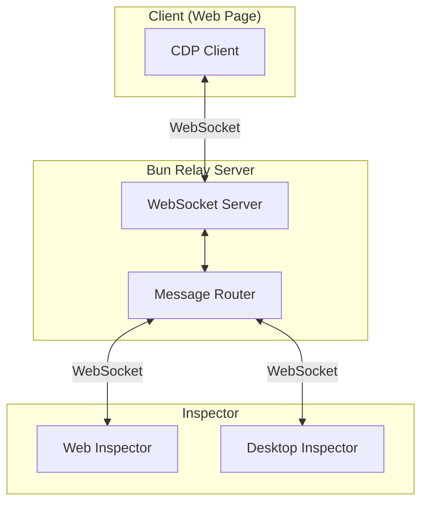
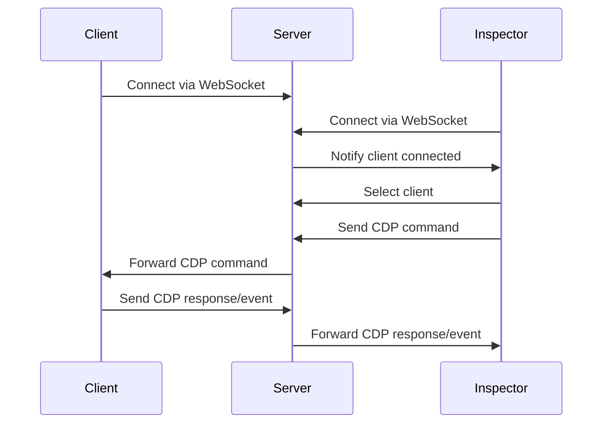

# Architecture Overview

Chrome Remote DevTools uses a 3-tier architecture to enable remote debugging of web pages.

## 3-Tier Structure

## Communication Flow

## Package Structure

- **@ohah/chrome-remote-devtools-server**: WebSocket relay server (TypeScript/Bun)
- **@ohah/chrome-remote-devtools-client**: CDP client (JavaScript, loaded in web pages)
- **@ohah/chrome-remote-devtools-inspector**: Inspector UI (React + Vite, shared for web/desktop)

## Data Storage

- **IndexedDB**: Used for offline logging and session replay data storage in the browser

## Key Components

### Client

The client implements CDP protocol on the client side, allowing web pages to be debugged remotely. It connects to the server via WebSocket and handles CDP commands and events.

### Server

The server acts as a relay between clients and inspectors. It manages WebSocket connections and routes CDP messages bidirectionally.

### Inspector

The Inspector provides the DevTools UI for debugging. It can run as a web application or desktop application (using Tauri).

## Next Steps

- Learn about the [Server Architecture](/architecture/server)
- Understand the [Client Implementation](/architecture/client)
- Explore the [Inspector UI](/architecture/inspector)
