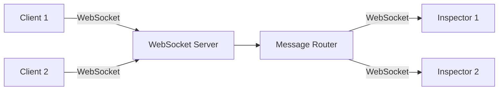
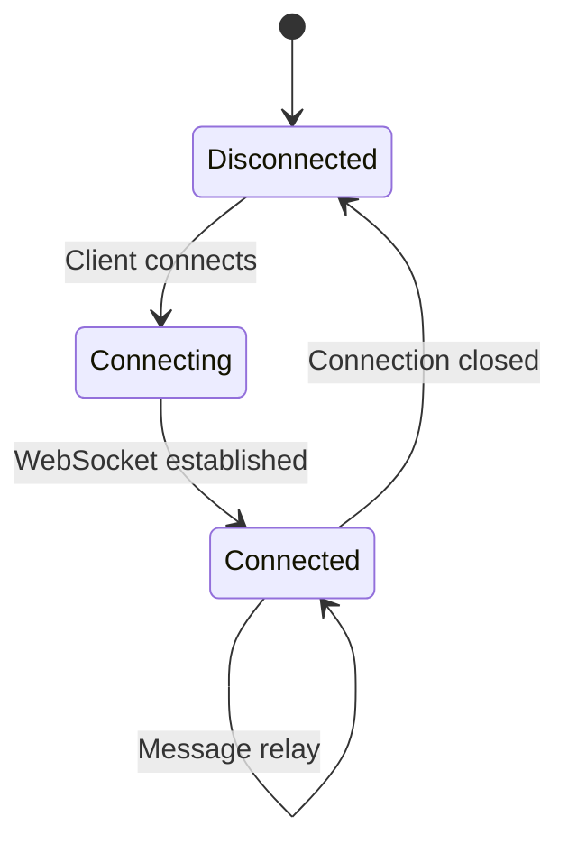
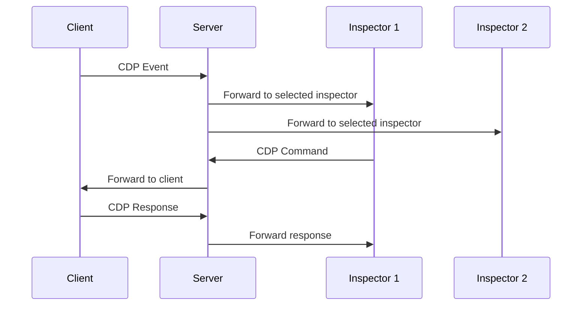

# Server Architecture

The server is a Rust-implemented WebSocket relay server that acts as a relay between clients and inspectors, routing CDP messages bidirectionally.

## WebSocket Relay Server



## Connection Management



## Message Routing

The server routes messages based on the connection type:

1. **Client to Inspector**: When a client sends a CDP event or response, the server forwards it to all connected inspectors that have selected that client.

2. **Inspector to Client**: When an inspector sends a CDP command, the server forwards it to the selected client.



## HTTP Endpoints

The server provides HTTP endpoints for client discovery:

- `GET /json` - Get all clients (legacy format)
- `GET /json/clients` - Get all clients with details
- `GET /json/inspectors` - Get all inspectors
- `GET /json/client/:id` - Get specific client
- `GET /client.js` - Serve built client script

## Features

- **Multiple Client Support**: Handle multiple client connections simultaneously
- **Multiple Inspector Support**: Support multiple inspectors connecting to the same or different clients
- **Client Switching**: Inspectors can switch between different clients
- **Message Relay**: Bidirectional message routing between clients and inspectors
- **Connection State Management**: Track and manage connection states

## Implementation

The server is implemented in Rust using:

- **Rust**: Systems programming language
- **Tokio**: Async runtime
- **Axum**: Web framework (HTTP and WebSocket)
- **tokio-tungstenite**: WebSocket library
- **serde**: Serialization/deserialization

## Execution Modes

The server can run in two modes:

### Standalone Mode

```bash
cargo run --bin chrome-remote-devtools-server -- --port 8080
```

Runs as a standalone server that web inspectors or external clients can connect to.

### Embedded Mode (Tauri)

Embedded as a library in the Tauri desktop app. The Inspector UI can start/stop the server via Tauri commands.

```rust
use chrome_remote_devtools_server::{ServerHandle, ServerConfig};

let handle = ServerHandle::new();
let config = ServerConfig::default();
handle.start(config).await?;
```
