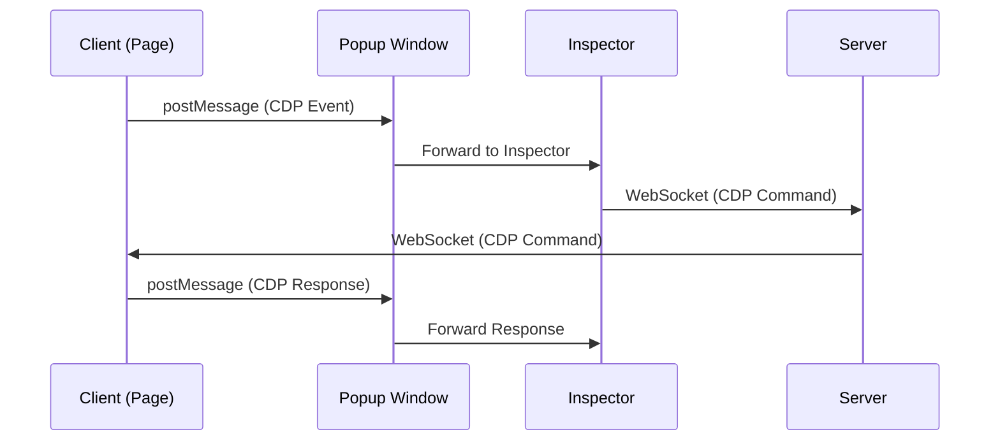

# Popup Console

This demonstrates how to use Chrome Remote DevTools in a popup window scenario, where the client uses postMessage instead of WebSocket.

## Overview

In popup mode, the client communicates with the Inspector via postMessage instead of WebSocket. This is useful when:
- WebSocket connections are restricted
- You need cross-origin communication

## Setup

### 1. HTML Setup

```html
<!DOCTYPE html>
<html>
<head>
  <title>Popup DevTools Example</title>
  <!-- Load client script without data-server-url -->
  <!-- Popup mode uses postMessage (no data-server-url needed) -->
  <script src="http://localhost:8080/client.js" data-enable-rrweb="true"></script>
</head>
<body>
  <div id="root"></div>
  <script type="module" src="/src/main.tsx"></script>
</body>
</html>
```

**Key Points:**
- No `data-server-url` attribute (uses postMessage mode)
- `data-enable-rrweb="true"` enables session replay

### 2. React Component

```tsx
import { useEffect, useRef } from 'react';
import { buildDevToolsUrl } from '../utils/devtools';

export default function DevToolsPopup({ clientId }: { clientId: string | null }) {
  const popupRef = useRef<Window | null>(null);

  useEffect(() => {
    if (!clientId) return;

    const devToolsUrl = buildDevToolsUrl(clientId);

    if (popupRef.current && !popupRef.current.closed) {
      popupRef.current.location.href = devToolsUrl;
    } else {
      popupRef.current = window.open(
        devToolsUrl,
        'devtools',
        'width=1200,height=800,resizable=yes,scrollbars=yes'
      );
    }
  }, [clientId]);

  return (
    <button onClick={() => popupRef.current?.focus()}>
      Open DevTools
    </button>
  );
}
```

## How It Works

1. **Client Initialization**: The client initializes without WebSocket connection (`skipWebSocket: true`)
2. **PostMessage Communication**: Client uses postMessage to communicate with the Inspector
3. **Popup Window**: Inspector opens in a popup window
4. **DevTools Integration**: DevTools iframe loads in the popup with WebSocket connection to server

## Communication Flow



## Benefits

- **No WebSocket Required**: Client doesn't need direct WebSocket connection
- **Cross-Origin Support**: Works across different origins
- **Popup Isolation**: DevTools runs in separate window
- **Session Replay**: Full session recording support

## See Also

- [Installation Guide](/examples/installation)
- [Client API](/api/client)

