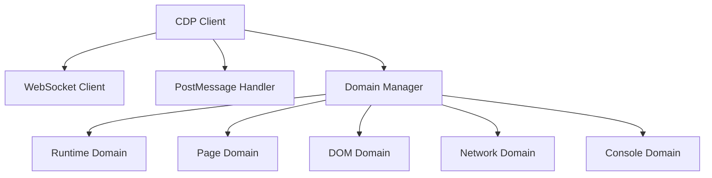
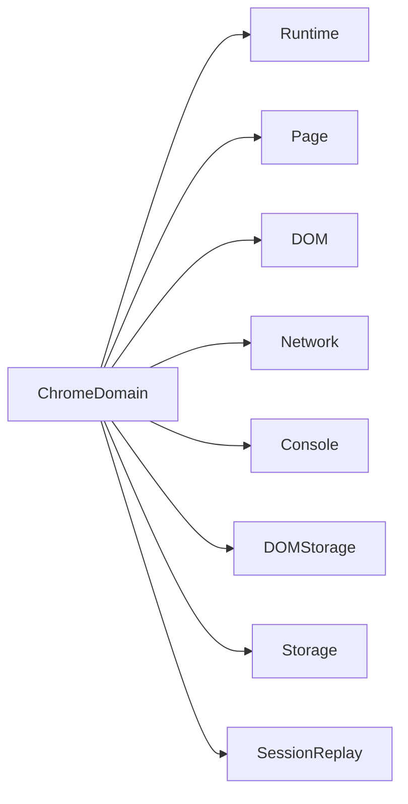
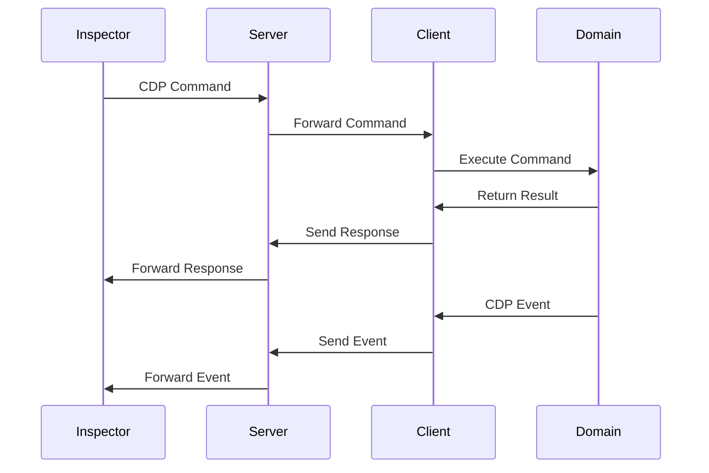
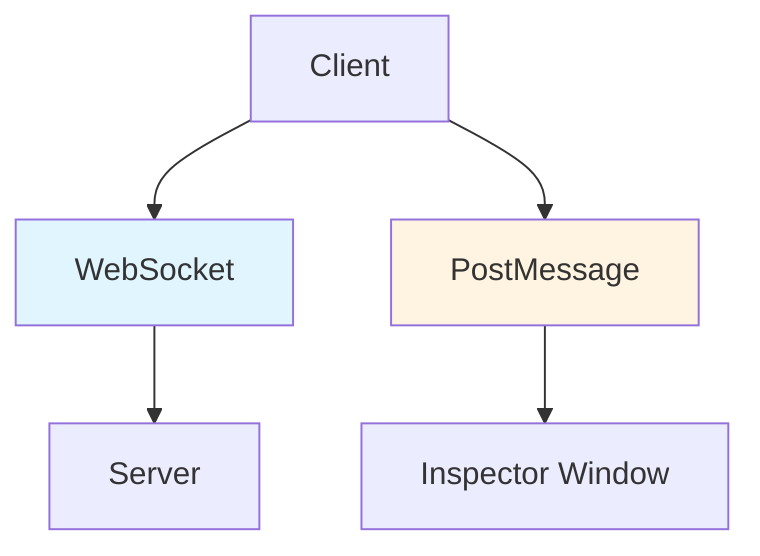

# 클라이언트 아키텍처

클라이언트는 클라이언트 측에서 Chrome DevTools Protocol (CDP)을 구현하여 웹페이지를 원격으로 디버깅할 수 있게 합니다.

## CDP 클라이언트 구조



## 도메인 구현

클라이언트는 여러 CDP 도메인을 구현합니다:



## 메시지 흐름



## 연결 방법

클라이언트는 두 가지 연결 방법을 지원합니다:

1. **WebSocket**: 서버를 통한 원격 디버깅 (일반적인 사용 사례)
2. **PostMessage**: postMessage API를 통한 통신 (로컬 데브툴 시나리오 용)



## 기능

- **CDP 프로토콜 구현**: 전체 클라이언트 측 CDP 구현
- **도메인 지원**: 여러 CDP 도메인 (Runtime, Page, DOM, Network 등)
- **이벤트 처리**: 자동 이벤트 발생 및 저장
- **이중 연결**: WebSocket 및 PostMessage 지원
- **세션 재생**: 세션 기록을 위한 선택적 rrweb 통합

## 초기화

클라이언트는 `init()` 함수를 사용하여 초기화합니다:

```typescript
import { init } from '@ohah/chrome-remote-devtools-client';

init({
  serverUrl: 'ws://localhost:8080',
  rrweb: {
    enable: true,
  },
});
```

Vanilla JavaScript (IIFE)의 경우 전역 API를 사용합니다:

```html
<script src="http://localhost:8080/client.js"></script>
<script>
  ChromeRemoteDevTools.init({
    serverUrl: 'ws://localhost:8080',
    rrweb: {
      enable: true,
    },
  });
</script>
```
