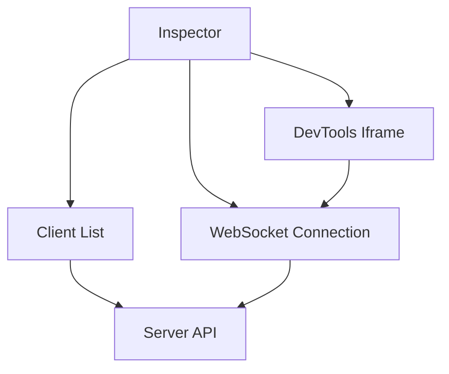
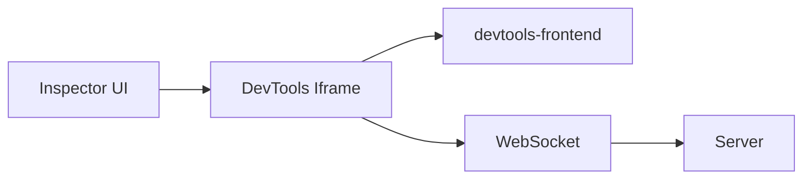
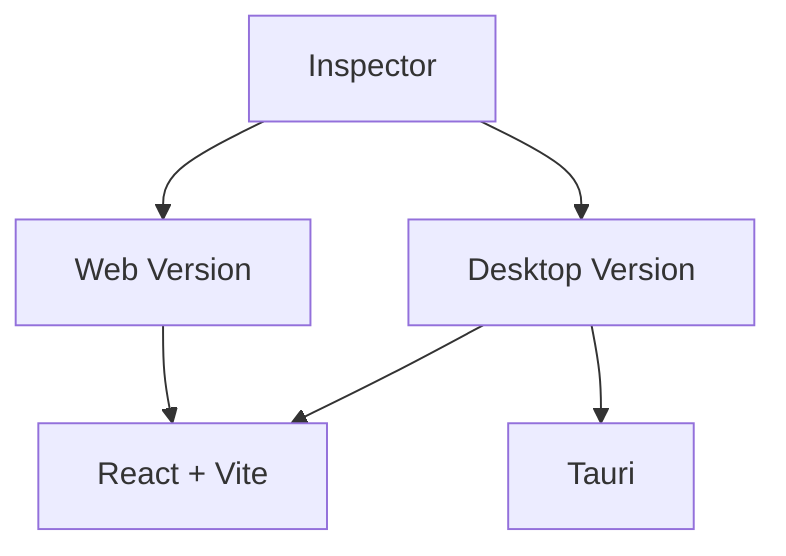

# Inspector 아키텍처

Inspector는 웹페이지를 원격으로 디버깅하기 위한 DevTools UI를 제공합니다. 웹 애플리케이션이나 데스크탑 애플리케이션(Tauri 사용)으로 실행할 수 있습니다.

## Inspector 구조



## DevTools 통합

Inspector는 iframe을 사용하여 devtools-frontend와 통합합니다:



## 클라이언트 선택 흐름


## 웹 및 데스크탑 버전

Inspector는 웹 및 데스크탑 버전을 모두 지원합니다:



## 기능

- **클라이언트 발견**: 연결된 클라이언트를 자동으로 발견하고 나열
- **클라이언트 선택**: 다른 클라이언트 간 전환
- **DevTools 통합**: iframe을 통한 전체 DevTools UI
- **WebSocket 통신**: 서버에 직접 연결
- **자동 새로고침**: 자동 클라이언트 목록 업데이트

## 구현

Inspector는 다음을 사용하여 구현됩니다:

- **React**: UI 프레임워크
- **Vite**: 빌드 도구
- **TanStack Router**: 라우팅
- **Tailwind CSS**: 스타일링
- **Tauri**: 데스크탑 앱 프레임워크 (선택 사항)

## DevTools URL 구성

Inspector는 WebSocket 구성을 사용하여 DevTools URL을 구성합니다:

```typescript
const devtoolsUrl = buildDevToolsUrl(clientId, serverUrl);
// Result: /devtools-frontend/?ws=localhost:8080/remote/debug/devtools/devtools-{clientId}?clientId={clientId}
```

iframe이 이 URL을 로드하면, 서버에 대한 WebSocket 연결로 devtools-frontend가 초기화됩니다.
