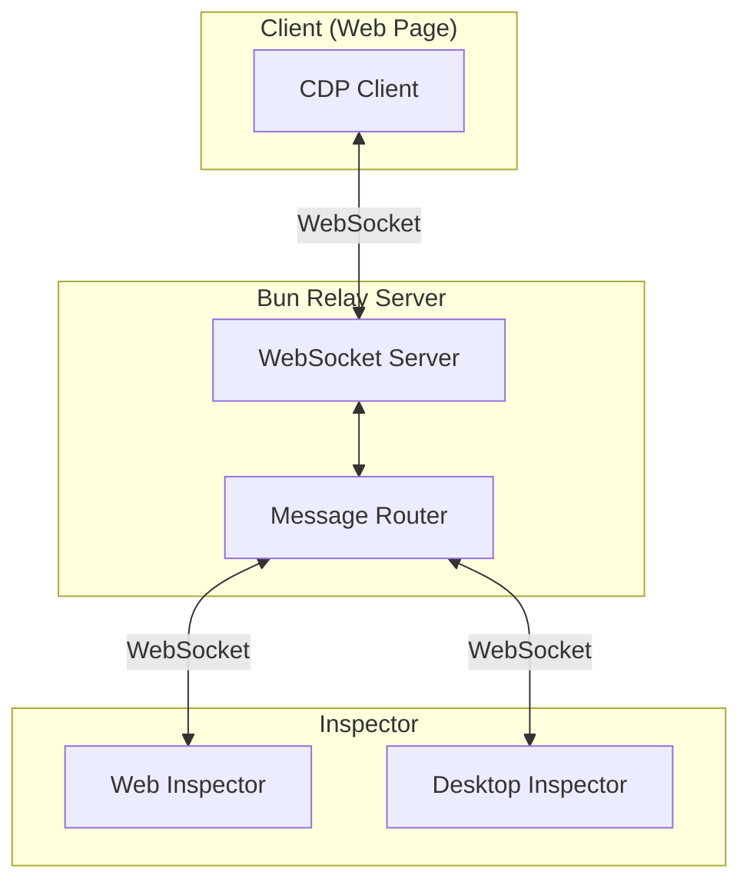
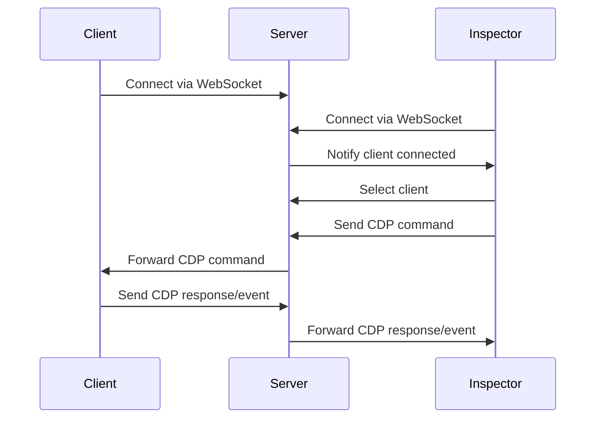

# 아키텍처 개요

Chrome Remote DevTools는 웹페이지의 원격 디버깅을 가능하게 하는 3계층 아키텍처를 사용합니다.

## 3계층 구조

## 통신 흐름

## 패키지 구조

- **@ohah/chrome-remote-devtools-server**: WebSocket 릴레이 서버 (TypeScript/Bun)
- **@ohah/chrome-remote-devtools-client**: CDP 클라이언트 (JavaScript, 웹페이지에 로드)
- **@ohah/chrome-remote-devtools-inspector**: Inspector UI (React + Vite, 웹/데스크탑 공유)

## 데이터 저장소

- **IndexedDB**: 브라우저에서 오프라인 로깅 및 세션 리플레이 데이터 저장에 사용

## 주요 구성 요소

### Client

클라이언트는 클라이언트 측에서 CDP 프로토콜을 구현하여 웹페이지를 원격으로 디버깅할 수 있게 합니다. WebSocket을 통해 서버에 연결하고 CDP 명령 및 이벤트를 처리합니다.

### Server

서버는 클라이언트와 Inspector 사이의 릴레이 역할을 합니다. WebSocket 연결을 관리하고 CDP 메시지를 양방향으로 라우팅합니다.

### Inspector

Inspector는 디버깅을 위한 DevTools UI를 제공합니다. 웹 애플리케이션이나 데스크탑 애플리케이션(Tauri 사용)으로 실행할 수 있습니다.

## 다음 단계

- [서버 아키텍처](/ko/architecture/server) 알아보기
- [클라이언트 구현](/ko/architecture/client) 이해하기
- [Inspector UI](/ko/architecture/inspector) 탐색하기
