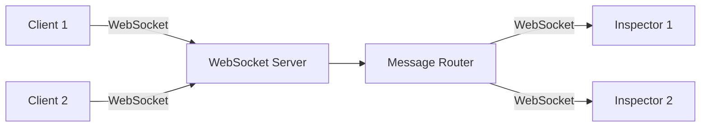
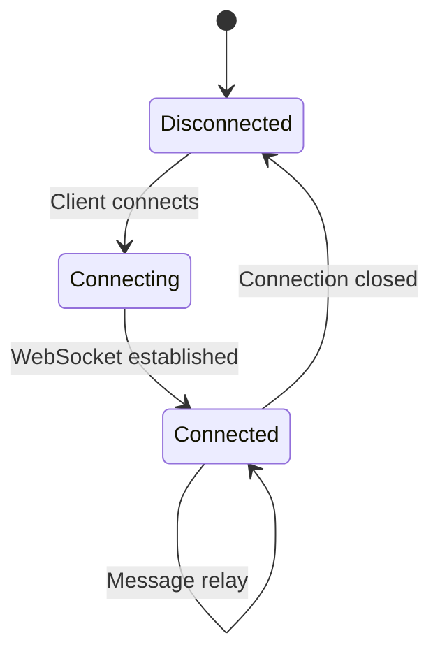
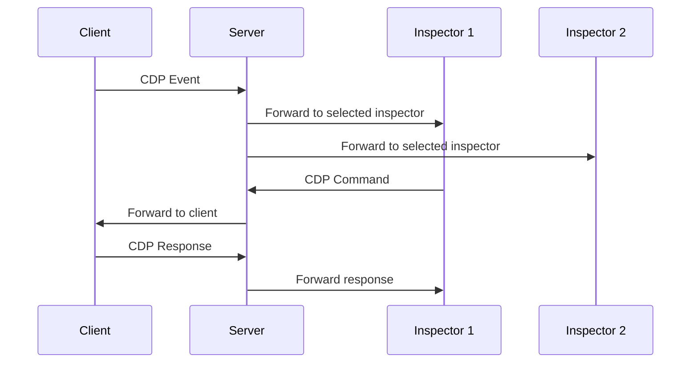

# 서버 아키텍처

서버는 클라이언트와 Inspector 사이의 WebSocket 릴레이 역할을 하며, CDP 메시지를 양방향으로 라우팅합니다.

## WebSocket 릴레이 서버

## 연결 관리

## 메시지 라우팅

서버는 연결 유형에 따라 메시지를 라우팅합니다:

1. **클라이언트에서 Inspector로**: 클라이언트가 CDP 이벤트나 응답을 보내면, 서버는 해당 클라이언트를 선택한 모든 연결된 Inspector에 전달합니다.

2. **Inspector에서 클라이언트로**: Inspector가 CDP 명령을 보내면, 서버는 선택된 클라이언트에 전달합니다.

## HTTP 엔드포인트

서버는 클라이언트 발견을 위한 HTTP 엔드포인트를 제공합니다:

- `GET /json` - 모든 클라이언트 가져오기 (레거시 형식)
- `GET /json/clients` - 모든 클라이언트 세부 정보 가져오기
- `GET /json/inspectors` - 모든 Inspector 가져오기
- `GET /json/client/:id` - 특정 클라이언트 가져오기
- `GET /client.js` - 빌드된 클라이언트 스크립트 제공
- `GET /test-page.html` - 테스트 페이지 제공

## 기능

- **다중 클라이언트 지원**: 여러 클라이언트 연결을 동시에 처리
- **다중 Inspector 지원**: 여러 Inspector가 동일하거나 다른 클라이언트에 연결 지원
- **클라이언트 전환**: Inspector가 다른 클라이언트 간 전환 가능
- **메시지 릴레이**: 클라이언트와 Inspector 간 양방향 메시지 라우팅
- **연결 상태 관리**: 연결 상태 추적 및 관리

## 구현

서버는 다음을 사용하여 구현됩니다:
- **Bun**: TypeScript 런타임
- **ws**: WebSocket 라이브러리
- **HTTP Server**: 정적 파일 및 API 엔드포인트 제공용
