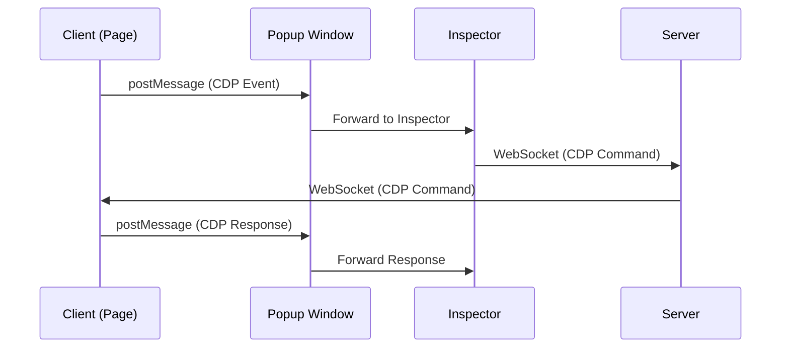

# 팝업 콘솔

클라이언트가 WebSocket 대신 postMessage를 사용하는 팝업 창 시나리오에서 Chrome Remote DevTools를 사용하는 방법입니다.

## 개요

팝업 모드에서 클라이언트는 WebSocket 대신 postMessage를 통해 Inspector와 통신합니다. 이는 다음과 같은 경우에 유용합니다:
- WebSocket 연결이 제한된 경우
- 크로스 오리진 통신이 필요한 경우

## 설정

### 1. HTML 설정

```html
<!DOCTYPE html>
<html>
<head>
  <title>Popup DevTools Example</title>
  <!-- data-server-url 없이 클라이언트 스크립트 로드 -->
  <!-- 팝업 모드는 postMessage 사용 (data-server-url 불필요) -->
  <script src="http://localhost:8080/client.js" data-enable-rrweb="true"></script>
</head>
<body>
  <div id="root"></div>
  <script type="module" src="/src/main.tsx"></script>
</body>
</html>
```

**핵심 포인트:**
- `data-server-url` 속성 없음 (postMessage 모드 사용)
- `data-enable-rrweb="true"`는 세션 재생을 활성화합니다

### 2. React 컴포넌트

```tsx
import { useEffect, useRef } from 'react';
import { buildDevToolsUrl } from '../utils/devtools';

export default function DevToolsPopup({ clientId }: { clientId: string | null }) {
  const popupRef = useRef<Window | null>(null);

  useEffect(() => {
    if (!clientId) return;

    const devToolsUrl = buildDevToolsUrl(clientId);

    if (popupRef.current && !popupRef.current.closed) {
      popupRef.current.location.href = devToolsUrl;
    } else {
      popupRef.current = window.open(
        devToolsUrl,
        'devtools',
        'width=1200,height=800,resizable=yes,scrollbars=yes'
      );
    }
  }, [clientId]);

  return (
    <button onClick={() => popupRef.current?.focus()}>
      Open DevTools
    </button>
  );
}
```

## 작동 방식

1. **클라이언트 초기화**: 클라이언트는 WebSocket 연결 없이 초기화됩니다 (`skipWebSocket: true`)
2. **PostMessage 통신**: 클라이언트는 Inspector와 통신하기 위해 postMessage를 사용합니다
3. **팝업 창**: Inspector가 팝업 창에서 열립니다
4. **DevTools 통합**: DevTools iframe이 서버에 대한 WebSocket 연결과 함께 팝업에 로드됩니다

## 통신 흐름



## 장점

- **WebSocket 불필요**: 클라이언트가 직접 WebSocket 연결이 필요하지 않음
- **크로스 오리진 지원**: 다른 오리진 간 작동
- **팝업 격리**: DevTools가 별도 창에서 실행
- **세션 재생**: 전체 세션 기록 지원

## 참고

- [설치 가이드](/ko/examples/installation)
- [Client API](/ko/api/client)
